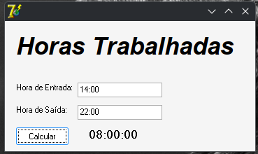

# 🕒 Horas Trabalhadas



Aplicação desktop simples desenvolvida em **Delphi 7** (linguagem **Object Pascal**), criada com o objetivo de calcular automaticamente a quantidade de horas trabalhadas com base na hora de entrada e saída.

Este projeto foi desenvolvido como parte de um estudo prático para aprimorar minhas habilidades em programação com Delphi e lógica de aplicações desktop.

---

## 🚀 Funcionalidades

- ✅ Inserir a **hora de entrada** e **hora de saída**.
- ✅ Calcular automaticamente o total de **horas trabalhadas**.
- ✅ Exibir o resultado no formato `HH:MM`.
- ✅ Interface simples e funcional, típica de aplicações Delphi.

---

## ⬇️ Como Baixar e Usar (sem precisar compilar)

Você pode usar o programa diretamente sem instalar o Delphi:

1. Acesse a página de **[Releases](https://github.com/Felipeflskater/Horas-Trabalhadas/releases)**.
2. Baixe o arquivo `HorasTrabalhadas.exe`.
3. Execute o programa (funciona em qualquer Windows).

> ⚠️ Não requer instalação. É um executável portátil.

---

## 💻 Como Compilar (para desenvolvedores)

Se deseja modificar o código-fonte:

1. Clone o repositório:
   ```bash
   git clone https://github.com/Felipeflskater/Horas-Trabalhadas.git
